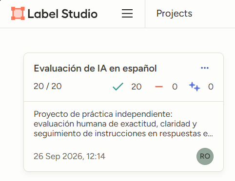
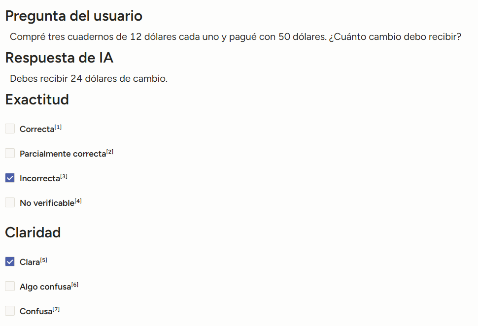
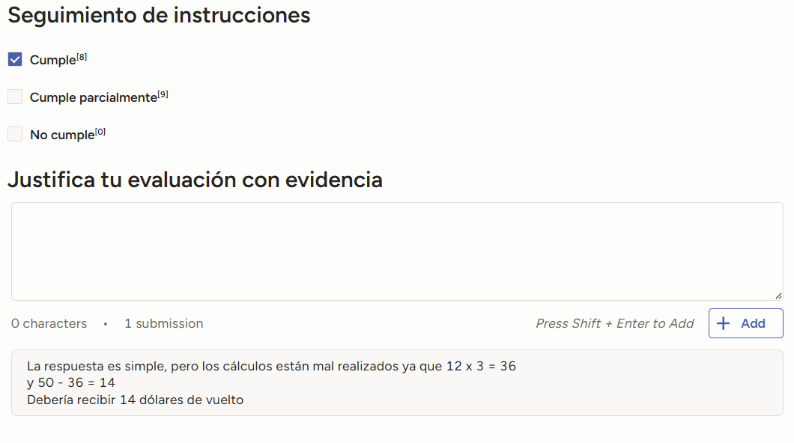

# Spanish AI Response Evaluation — Label Studio

## English summary

A hands-on portfolio project involving **20 Spanish-language synthetic cases**, evaluated in Label Studio across **accuracy, clarity, and instruction following**.

- Applied documented annotation guidelines and recorded evidence for each decision.
- Identified calculation, translation, summarization, and formatting errors, as well as claims that could not be verified from the available information.
- Reviewed annotation consistency with AI assistance and exported the completed dataset in JSON format.

This was a guided learning exercise using synthetic examples prepared with AI assistance. The guidelines were refined during the exercise, and some justifications were revised with AI support. It is **not a benchmark of a real model or work commissioned by Rise Data Labs**.

**Explore the evidence:** [annotation guidelines (Spanish)](guia_evaluacion_es.md), [practice report (Spanish)](informe_practica_es.md), and [20 annotated cases (JSON)](evaluaciones_es_final.json). Screenshots and a worked example appear below. No installation is needed to review the portfolio.

## Evaluación de respuestas de IA en español

**20 casos anotados · Label Studio · Exactitud, claridad y seguimiento de instrucciones**

Proyecto personal de portafolio que muestra un flujo de evaluación humana: aplicar criterios, detectar errores, justificar decisiones y revisar la consistencia de las anotaciones.

La muestra utiliza respuestas sintéticas preparadas para una práctica guiada con asistencia de IA. No es una evaluación de rendimiento de un modelo real ni un trabajo encargado por Rise Data Labs.

## Qué hice

- Configuré un proyecto de evaluación en Label Studio sobre Windows.
- Anoté 20 pares de pregunta y respuesta en español.
- Evalué por separado exactitud, claridad y seguimiento de instrucciones.
- Documenté evidencia para errores de cálculo, traducción, resumen y formato.
- Revisé mis decisiones con asistencia de IA y exporté las anotaciones en JSON.

## Un ejemplo

**Pregunta:** Compré tres cuadernos de 12 dólares cada uno y pagué con 50 dólares. ¿Cuánto cambio debo recibir?

**Respuesta evaluada:** Debes recibir 24 dólares de cambio.

| Criterio | Etiqueta | Evidencia |
|---|---|---|
| Exactitud | Incorrecta | 3 × 12 = 36; 50 − 36 = **14**, no 24. |
| Claridad | Clara | La respuesta es breve y comprensible. |
| Instrucciones | Cumple | Responde con el cambio solicitado; el error de cálculo se registra en exactitud. |

Esta separación sigue la convención de la guía: «Cumple» no implica que una respuesta sea globalmente correcta.

## Evidencia visual

Ver etiquetas y justificación del ejemplo

## Documentación y datos

- [Guía de evaluación](guia_evaluacion_es.md): definiciones y reglas de decisión.
- [Informe de la práctica](informe_practica_es.md): método, resultados y limitaciones.
- [Exportación final de Label Studio](evaluaciones_es_final.json): 20 tareas con etiquetas y justificaciones.

## Resultados descriptivos

| Exactitud de las respuestas de ejemplo | Casos |
|---|---:|
| Correcta | 12 |
| Parcialmente correcta | 3 |
| Incorrecta | 3 |
| No verificable | 2 |

19 respuestas se etiquetaron como claras y una como confusa. En instrucciones, 16 cumplen y cuatro cumplen parcialmente. Estas cifras describen los ejemplos seleccionados; no son una nota del evaluador ni una métrica de un modelo.

## Alcance

Práctica formativa con un anotador humano y revisión asistida por IA. Algunos criterios y textos se ajustaron durante la revisión. No hubo una segunda evaluación humana independiente ni medición de acuerdo entre anotadores. Las capturas corresponden al entorno local; los datos y documentos permiten examinar el trabajo sin instalar Label Studio.
